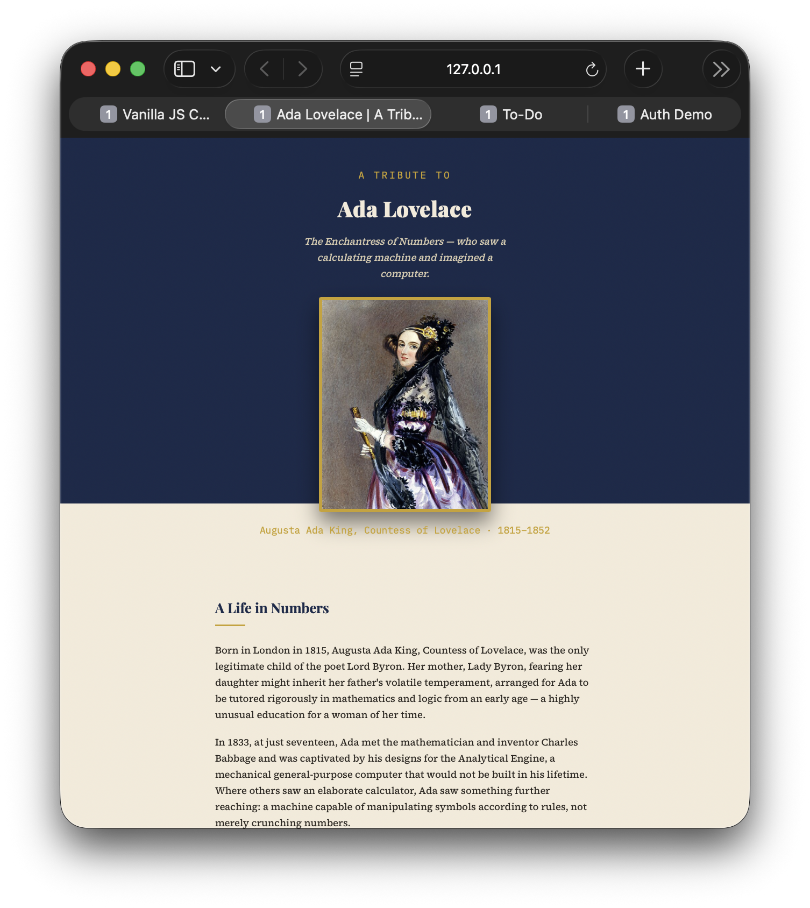

# Ada Lovelace — Tribute Page

A tribute page for Ada Lovelace, built with semantic HTML5 and modern CSS3.

**Live demo:** https://prachi-code-arch.github.io/OIBSIP/WebDev-L2-TributePage/



## Features

- Page header with title and tagline
- Responsive hero image with a fixed aspect ratio, scaling down cleanly on mobile
- Four-paragraph biography section
- A styled timeline of achievements, presented as a "punched ledger" — a visual nod to the punch cards used to program the mechanical Analytical Engine that Lovelace wrote for
- A distinctly styled blockquote pulled from Lovelace's own 1843 writing (public domain)
- Two-color background split (ink navy / parchment) with three paired Google Fonts

## Tech stack

- Semantic HTML5: `<header>`, `<main>`, `<section>`, `<figure>`/`<blockquote>`/`<figcaption>`, and an `<ol>` for the timeline (an ordered list, since the events are genuinely chronological)
- CSS3: `linear-gradient` for the background split, `clamp()` for fluid type sizing, `aspect-ratio` + `object-fit` for the responsive hero image
- Google Fonts: Playfair Display (headings), Source Serif 4 (body text), IBM Plex Mono (labels/dates)

## Files

```
tribute-page/
├── index.html   — semantic page structure and content
└── style.css    — ink & parchment visual design
```

## Run it locally

No build step required. Open `index.html` directly in a browser, or serve with:

```bash
npx serve .
```

## Content note

The hero image is loaded from Wikimedia Commons and is in the public domain. If you'd rather not depend on an external image URL, download a copy locally and update the `src` attribute in `index.html` to point to it instead.

The blockquote is Ada Lovelace's own words from *Notes on the Analytical Engine* (1843), which is in the public domain — safe to quote in full.