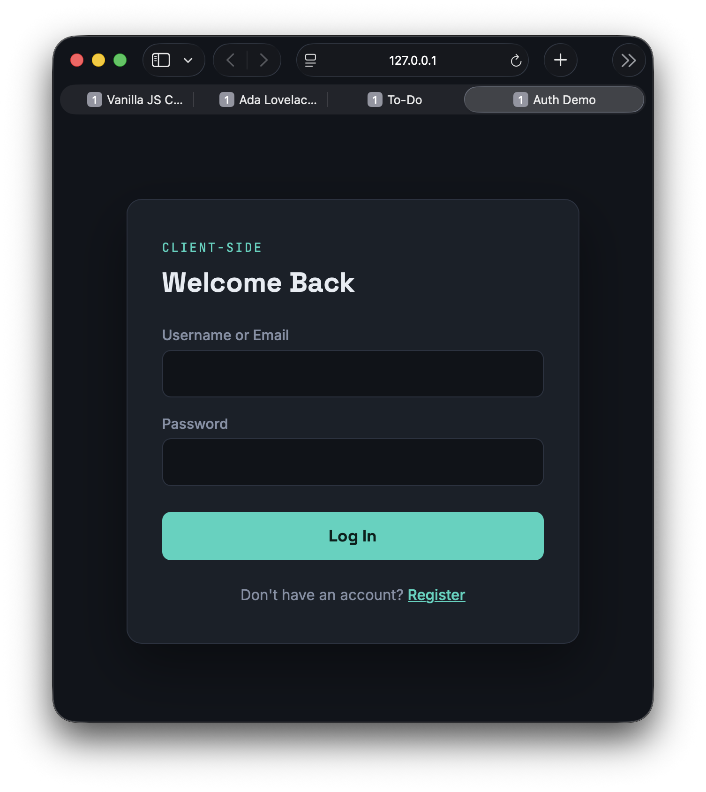
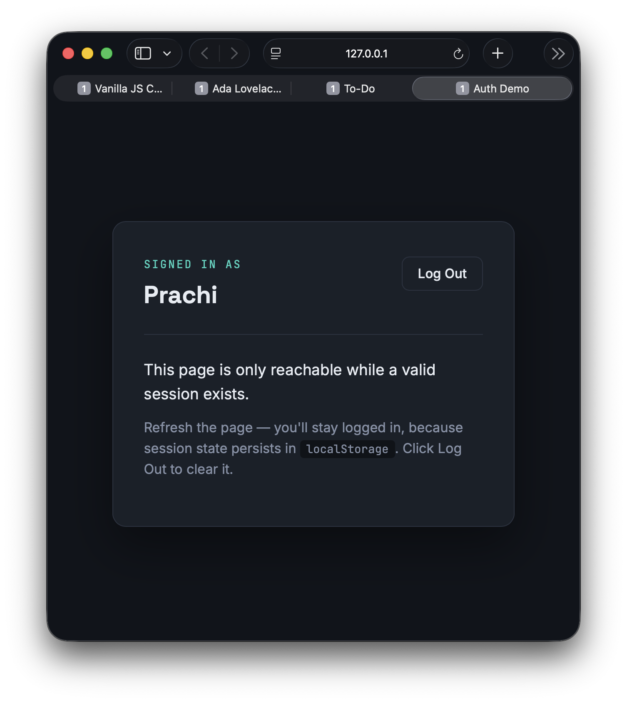

# Client-Side Login Authentication System

A front-end-only authentication demo — registration, login, and a protected dashboard — built with HTML5, CSS3, vanilla JavaScript, and `localStorage`.

**Live demo:** _add your GitHub Pages link here after deploying_



## ⚠️ Security disclaimer

**This is a learning project, not a real authentication system.** Everything here runs in the browser, which means:

- Anyone can open DevTools and read every stored password hash directly out of `localStorage`
- Anyone can fake a logged-in session by running one line in the console (`localStorage.setItem('auth_session', 'anything')`) — no password required
- There is no server validating anything; all "security" here is purely illustrative

A real system would hash and store passwords **server-side** (e.g. bcrypt or argon2), track sessions with HTTP-only cookies or signed tokens the client can't read or forge, and never trust anything the client sends without server-side verification.

This project exists to demonstrate the *shape* of an auth flow — validation, duplicate checking, hashing before storage, gated views — for portfolio/learning purposes only.

## Features

- [x] Registration page: username, email, password fields + Register button
- [x] Password validation: minimum 8 characters, at least 1 number
- [x] Duplicate username/email check, with a clear error if the account already exists
- [x] Login page: username-or-email + password + Login button
- [x] Generic error message on failed login (never reveals whether the identifier or the password was wrong, to prevent account enumeration)
- [x] Protected dashboard view — only rendered when a valid session exists; the app boots straight to the login screen otherwise
- [x] Logout button that clears the session and returns to login
- [x] Passwords hashed with SHA-256 via `crypto.subtle.digest`, with a random per-user salt (not required by the original brief, but added since unsalted hashes are vulnerable to precomputed rainbow-table lookups)
- [x] Basic form validation on both pages — empty submissions are explicitly blocked with a clear message, separate from credential-specific errors

## Tech stack

- HTML5 (three views in one page, toggled via the `hidden` attribute for accessibility)
- CSS3 (dark "security console" visual design)
- Vanilla JavaScript, split into two modules:
  - `auth.js` — all logic: hashing, salting, storage, validation, session state. Contains **zero DOM references**, so it could be unit-tested independently of any UI.
  - `app.js` — all DOM/UI wiring. Never touches `localStorage` directly; only calls functions exposed by `auth.js`.

## Files

```
auth-app/
├── index.html   — register / login / dashboard views
├── style.css    — security-console visual design
├── auth.js      — hashing, storage, validation, session logic (no DOM)
└── app.js       — view routing and form event handling (all DOM)
```

**Load order matters:** `auth.js` must be included before `app.js` in `index.html`, since `app.js` calls functions defined in `auth.js`.

## Run it locally

No build step required. Open `index.html` directly in a browser, or serve with:

```bash
npx serve .
```

## What a production version would change

- Move all password handling to a server; the client should never compute or see a password hash
- Store sessions as HTTP-only, `Secure`, `SameSite` cookies or short-lived signed JWTs — never in `localStorage`, which any script on the page can read
- Add rate limiting on login attempts to slow brute-force guessing
- Add CSRF protection once a real server and cookies are involved