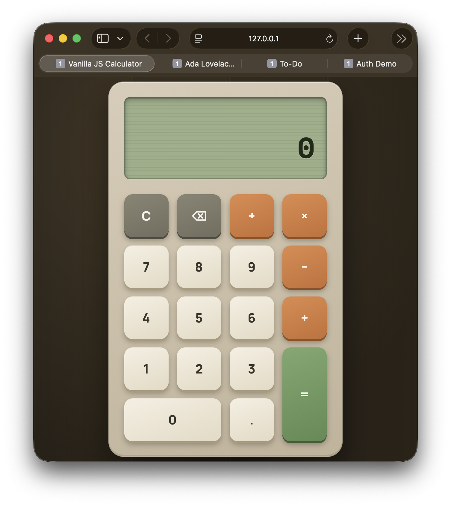

# Calculator

A calculator built with HTML5, CSS3, and vanilla JavaScript — no frameworks, no `eval()`.

**Live demo:** _add your GitHub Pages link here after deploying_



## Features

- Digit input (0–9), decimal point, and all four basic operators (+, −, ×, ÷)
- Chained calculations (e.g. `5 + 3 + 2 =`) and mid-expression operator switching
- Clear (C) and Backspace
- Division-by-zero handled gracefully with an on-screen error message, instead of crashing or showing `Infinity`
- Floating-point rounding correction (so `0.1 + 0.2` doesn't show `0.30000000000000004`)

## Tech stack

- HTML5 (semantic structure, `data-*` attributes for button behavior)
- CSS3 (Grid layout for the keypad, custom tactile button styling)
- Vanilla JavaScript (no libraries) — all math is done manually via a `calculate()` function, never `eval()`

## How it works

State is tracked in a single JS object (`firstOperand`, `operator`, `currentInput`, `waitingForSecondOperand`) rather than being parsed back out of the display text. Every button click updates this state, then a single `updateDisplay()` function re-renders the screen from it. This keeps the display as a pure reflection of state, which avoids a whole class of bugs common in beginner calculator implementations.

## Files

```
calculator/
├── index.html   — structure and button grid
├── style.css    — retro desk-calculator visual design
└── script.js    — state management and math logic
```

## Run it locally

No build step required. Clone the repo and open `index.html` directly in a browser, or serve the folder with any static server, e.g.:

```bash
npx serve .
```

## Known limitations

- No keyboard input support yet (mouse/touch only)
- No percentage or memory (M+/M−) functions