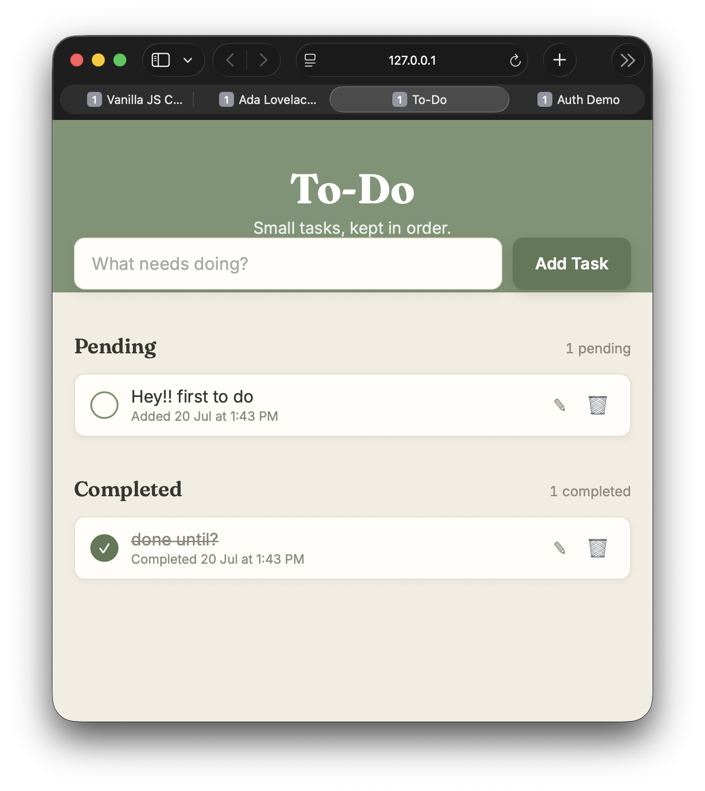

# To-Do App

An interactive to-do list built with HTML5, CSS3, and vanilla JavaScript, with full persistence via `localStorage`.

**Live demo:** _add your GitHub Pages link here after deploying_



## Features

- [x] Input field + Add Task button (submits on click or Enter)
- [x] Separate Pending and Completed sections
- [x] Toggle a task's completion state (stamp-style circular checkbox)
- [x] Edit a task's text inline (pencil icon → input field, save on Enter/blur, cancel on Escape)
- [x] Delete a task permanently
- [x] Live task counters — "X pending" / "Y completed" — above each list
- [x] **Bonus:** Timestamp on each task, showing when it was added, or when it was completed (switches automatically based on state)
- [x] **Bonus:** Full persistence via `localStorage` — tasks survive a page refresh
- [x] Friendly empty-state messages when a list has no items

## Tech stack

- HTML5 with a `<template>` element for the reusable task-card markup
- CSS3 (custom stamp-style checkbox, index-card task styling, responsive layout)
- Vanilla JavaScript, structured in clear sections: DOM references → storage layer → state → render → actions → event wiring

## Architecture notes

- **Single source of truth:** a `tasks` array holds all task data (`id`, `text`, `completed`, `createdAt`, `completedAt`). Every action (add/toggle/edit/delete) mutates this array, then calls one `render()` function that rebuilds the DOM and saves to storage — the DOM is never edited directly outside of `render()`.
- **Storage layer:** all `localStorage` reads/writes are wrapped in a small `storage` object with `try/catch`, so a full or blocked storage doesn't crash the app.
- **Stable IDs:** each task gets a `crypto.randomUUID()` on creation, rather than relying on array index — important, since indexes shift when tasks are filtered or deleted.

## Files

```
todo-app/
├── index.html   — structure, including the <template> for task cards
├── style.css    — stationery/index-card visual design
└── script.js    — state, storage, rendering, and actions
```

## Run it locally

No build step required. Open `index.html` directly in a browser, or serve with:

```bash
npx serve .
```

## Known limitations

- No drag-to-reorder
- No due dates or categories/tags
- Data is stored per-browser, per-device (as is inherent to `localStorage` — it doesn't sync across devices)